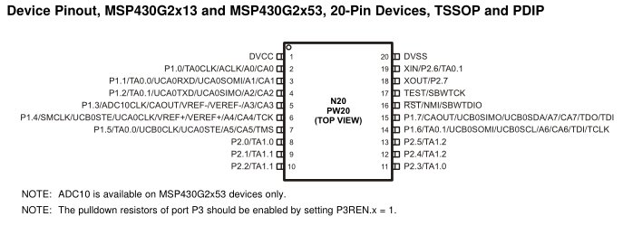
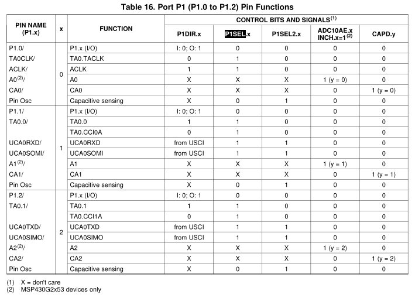

# Lesson 13 Notes

## Readings
[Memory-mapped IO](http://en.wikipedia.org/wiki/Memory-mapped_I/O)

## Assignment

## Lesson Outline
- Peripherals
- Memory-Mapped IO
- Ports
- GPIO
- Multiplexing

## Peripherals

Alright, so we've learned that we can do a lot of interesting things using the MSP430's CPU via its instruction set architecture.

But the power of an MCU isn't in its ability to accomplish general-purpose computing. It's meant to be embedded in the real world, interacting with peripherals without human intervention - and their design is finely tuned for those functions. In that regard, there's a ton of built-in hardware support to make common embedded functions fast and easy for the programmer.

Here's a rundown of some of the features that the MSP430G2xx has hardware support for (show MSP430 wikipedia):

- Watchdog Timer
- Universal Serial Communication Interface (USCI) - implements SPI and I2C protocols
- Pulse Width Modulation (PWM) - we'll use this later to drive the robot
- Temperature Sensor
- Capacitive Touch I/O

Different variants of the MSP430 support a huge array of peripherals.

Even within the MSP430, there is a ton of diversity in the peripherals that different variants support. That's where scoping the problem you're trying to solve is important. You want all of the features you need, but don't want to pay for additional hardware that you'll never use. More features = more expensive.

Remember how you had to implement multiplication in software in Lab 1 - "Calculator" - (for A Functionality)? There are variants of the MSP430 that come with hardware multipliers that support multiply instructions.

Most of these features are beyond the scope of this class. But we'll introduce you to a couple and give you the tools to learn more about the peripherals you'll need for future projects.

## Ports


## Memory-Mapped IO

Talk about memory-mapped vs port IO.

## GPIO

General Purpose Input Output (GPIO) is the default peripheral available on your ports.  When configured in output mode, this allows you to drive each bit individually to logic high or low.  When configured in input mode, you can read logic high or low from an external source.  It's perfectly acceptable to have some pins be output and others input on the same port.

The registers used to configure GPIO are PxDIR, PxOUT, and PxIN.

Let's say I wanted to configure P1.0-3 to be output and P1.4-7 to be input.  Code would look like this:
```
mov.b   #0b00001111, &P1DIR

; drive P1.0-3 all high
bis.b   #0b00001111, &P1OUT

; this would work also
mov.b   #0xff, &P1OUT

; read from P1.4-7 to a register
mov.b   &P1IN, r5
```

Since you have complete control, GPIO is infinitely flexible.  If the MCU you're using lacks a peripheral implementing a certain protocol and it's impractical to get one that has it, it's always possible to bit-bang the protocol.  That involves driving GPIO to achieve the individual bits you need to communicate.

## Multiplexing

Pins are expensive - and most applications won't use all of the features available in a chip for a single application. So designers save on cost by making many different functions available on the same pin.

Some dev boards give you a ton of pins *[show S12 dev board]*.  Ours does not.

Remember the pinout for our MSP430G2553:



We can only use a port for one purpose at a time. So we need a way to select the particular function we want a pin to perform. We accomplish that via the PxSEL and PxSEL1 registers. Different combinations of these bits make different functions available on a pin. The details are in the [MSP430G2x53 2x13 Mixed Signal MCU Datasheet](/datasheets/msp430g2x53_2x13_mixed_sig_mcu.pdf).

Here's an example from the datasheet:



Let's say I wanted to make the UCA0SOMI function available on P1.1. Here's the code I'd use:

```
; 'from USCI' means this bit is set automatically by the USCI when enabled
bis.b   #BIT1, P1SEL   
bis.b   #BIT1, P1SEL2

; others are set correctly by default - you should set them if previous code used them
```

Next lesson, we'll learn about the Serial Peripheral Interface (SPI) - which the MSP430 has hardware support for.  You'll need all of this knowledge to configure / use the SPI subsytem on Lab 3.
