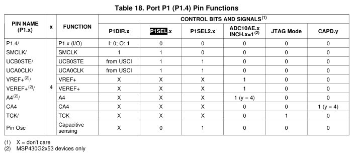

# Lesson 15 Notes

## Readings
[Serial Peripheral Interface (SPI)](http://en.wikipedia.org/wiki/Serial_Peripheral_Interface_Bus)
[Lab 3](/labs/lab3/index.html)

## Assignment
[Lab 3](/labs/lab3/index.html) Prelab

## Lesson Outline
- Serial Comm Fundamentals
- Serial Peripheral Interface (SPI)
- SPI on the MSP430
- Lab 3 Introduction
- Logic Analyzer Demo

*[Syllabus on big screen.]*  Three full lessons for Lab 3!  This doesn't mean that you've got some time to relax - this means that Lab 3 is a lot of work.  I'll discuss it more at the end of the lesson, but you'll be interfacing with external hardware for the first time in this lab.  *[Show lab demo on big screen]*.  To interface with the LCD, you need to use a protocol call SPI - the Serial Peripheral Interface.  That's what we'll talk about today.

Everything we do today will prepare you for Lab 3.

## Serial Comm Fundamentals


Our MSP430 is very pin-limited.

## Serial Peripheral Interface (SPI)


Hardware support for SPI on MCUs is usually very flexible.  There are configuration bits in the SPI control registers that can control all of these characteristics.  This is because peripherals use a wide range of SPI configurations - it's critical that you read the datasheet for the SPI component you're trying to interface with and match its expectations. 

## SPI on the MSP430

In the MSP430 Family Users Guide, they offer a suggested SPI initialization sequence:


**Step 1**

Setting the UCSWRST bit in the appropriate UCSI control register resets the subsystem into a known state.  All the registers will hold their default values.

**Step 2**

Now we need to 

**Step 3**


All the ports on our MSP430 are multiplexed!  We need to set the PxSEL and PxSEL2 ports so that we have access to the SPI signals we need!

**Step 4**


**Step 5**

Registers

Flags - the Tx flag does not mean that the transmission itself is complete, just that it's ready for the next byte!

### Monitoring SPI Status

Talk about Tx, Rx flags.  Make it known that when Tx is set, that just mades that you're able to write another byte.  It does NOT mean that the transmission is complete!

## Lab 3 Introduction

## Logic Analyzer Demo

I'm going to walk you through the majority of your prelab right now by showing you how to do Step 1 of Lab 3.  Here's what it says:

> **Step 1**: The Subsystem Master Clock (SMCLK) is the same speed as the Master Clock (MCLK) that runs your CPU.  Measure its period via logic analyzer - you'll want to screen capture / print this for your lab notebook.  There will be a table on the board for all students to record their CPU speed - record yours there.  **Never forget to ground your logic analyzer**.

Remember, the pins on our MSP430 are multiplexed because we don't have many.  We need to write some code to make it available on one of our pins so we can measure it.  Here's the MSP430G2553 pinout:


Looks like the SMCLK is available on P1.4 if I set the P1DIR, P1SEL, and P1SEL2 registers properly.  To the Users Guide!



Using this, here's the code we need to get access to SMCLK:
```
mov.b   #0b00010000, &P1DIR
mov.b   #0b00010000, &P1SEL
```

Ok, now we'll use the Logic Analyzer to look at the signal and do some measurements.
